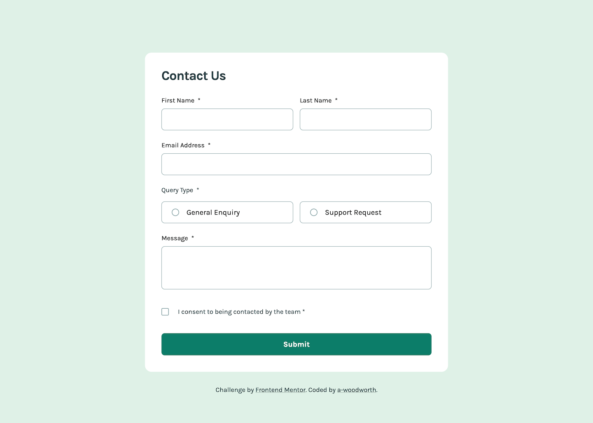
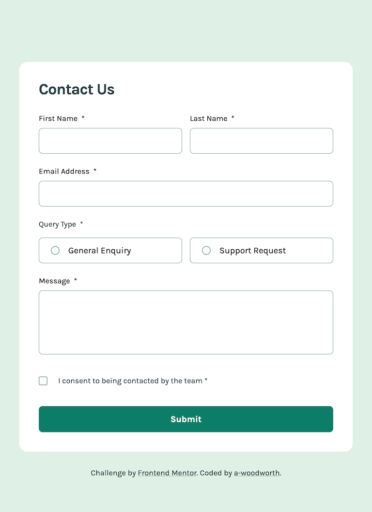
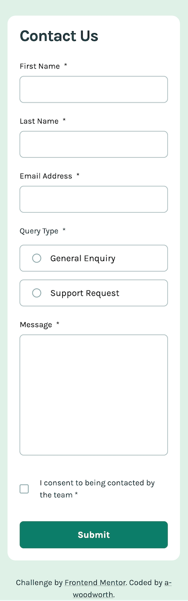

# Frontend Mentor - Contact Form Solution

This is a solution to the [Contact form challenge on Frontend Mentor](https://www.frontendmentor.io/challenges/contact-form--G-hYlqKJj).

## Table of contents

- [Overview](#overview)
  - [The challenge](#the-challenge)
  - [Screenshots](#screenshots)
  - [Links](#links)
  - [Built with](#built-with)
  - [Useful resources](#useful-resources)

## Overview

### The challenge

Users should be able to:

- Complete the form and see a success toast message upon successful submission
- Receive form validation messages if:
  - A required field has been missed
  - The email address is not formatted correctly
- Complete the form only using their keyboard
- Have inputs, error messages, and the success message announced on their screen reader
- View the optimal layout for the interface depending on their device's screen size
- See hover and focus states for all interactive elements on the page

### Screenshots

**Desktop**

**Tablet**

**Mobile**

### Links

- Solution URL: [Solution]()
- Live Site URL: [Live Site](https://a-woodworth.github.io/contact_form_challenge)

### Built with

- Semantic HTML5 markup
- CSS Custom properties (variables)
- JavaScript
- [Sass](https://sass-lang.com) - CSS Preprocessor
- Constraint Validation API

### Useful Resources

- Sara Soueidan: [Inclusively Hiding & Styling Checkboxes and Radio Buttons](https://www.sarasoueidan.com/blog/inclusively-hiding-and-styling-checkboxes-and-radio-buttons)
- Scott O'Hara: [One Last Time: Custom Styling Radio Buttons and Checkboxes](https://www.scottohara.me/blog/2021/09/24/custom-radio-checkbox-again.html)
- Stephanie Eckles: [Pure CSS Custom Styled Radio Buttons](https://moderncss.dev/pure-css-custom-styled-radio-buttons)
